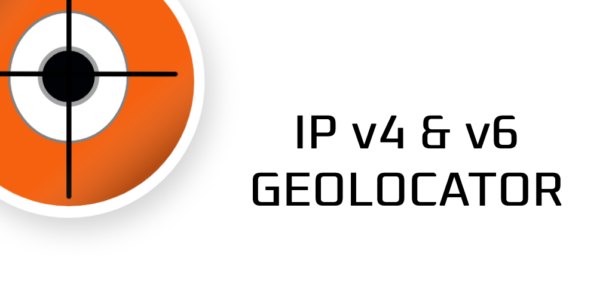

IP v4&v6 Geolocate
==========
[An Adroid based IP(Internet Protocol) v4 & v6 Geolocation Tool](https://github.com/ericwarriner/Geolocate)

This is a long overdue update to an application that I published on the google play store over a decade ago. Original source code found here:
[GitHub](https://github.com/ericwarriner/ericonjava/tree/master/IpGeolocate)

This update was completed as an effort to learn the magic of the ✨<Magic>✨ [Flutter](https://flutter.dev/) framework and [Dart.js](https://dart.dev/) ✨</Magic> ✨.

As per licensing - [Attribution-ShareAlike 4.0 International (CC BY-SA 4.0)](https://creativecommons.org/licenses/by-sa/4.0/)
 This product includes GeoLite2 data created by MaxMind, available from [MaxMind](https://www.maxmind.com). 

Special thanks to maxmind as this app would not be possible without their data. 

Lastly, regarding the Maxmind GeoLite2 database, their documentation clearly states that "Latitude and Longitude results are not precise and should not be used
to identify a particular street address or household"

Application is currently published in the Google Play App Store. Please download it here: [IPv4 Geolocate](https://play.google.com/store/apps/details?id=com.github.ericwarriner.geolocate)
